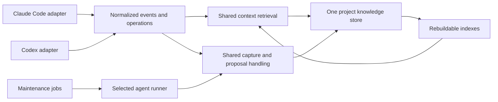

# Cortex for Codex and Claude Code — investigation and proposed adaptation

Date: 2026-09-21. Repository baseline: `a66041b`. Status: investigation and design proposal, not an approved schema or implemented migration.

Cortex can support both agents without duplicating its knowledge store. Its existing query, validation, citation, extraction, and proposal machinery provides a useful foundation. The integration boundary needs to move: today Claude Code assumptions extend into installation, session interpretation, provenance, learned skills, and maintenance. Adding `AGENTS.md` alone would make the product discoverable while leaving important behavior disconnected.

The recommended outcome is one project-owned memory layer, shared retrieval and capture operations, and explicit host adapters. Deliver useful interactive context first; add background learning and unattended maintenance after their contracts are proven.

**1. Evidence and scope**

This investigation traced source and skill dependencies, reviewed the relevant specs and schema, rebuilt the project with Node 22.22.2, inspected installed Codex CLI 0.155.1 help/features, consulted current official OpenAI documentation, and ran isolated compatibility probes. The probes create a temporary project and fake home directory. They do not invoke a model, read personal conversation history, install integrations into this repository, or register scheduled tasks.

The earlier repository review in this conversation ran all 152 test files successfully under Node 22: 2,822 tests passed. That is an existing-behavior baseline, not proof of Codex compatibility. This investigation rebuilt successfully and ran the focused probes; it did not repeat the full unchanged suite.

Reproduce from the repository root with Node >=20:

```sh
pnpm build
node plans/2026-09-21-codex-claude-investigation/probe.mjs
```

The probe prints results and writes `/tmp/cortex-codex-compat-probe.json`; an optional first argument changes the output file. Temporary fixtures remain available for inspection. [Captured results](results.json) omit the machine-specific fixture path. [Probe source](probe.mjs) is an investigation aid, not a production adapter or an agent-quality benchmark.

| Probe | Observed result | Consequence |
|---|---|---|
| Fresh `init`, using `superpowers` profile | Creates CLAUDE.md, Claude settings, all 21 Claude skills, and SpecFlow scaffolding; no Codex integrations | Process profile does not select a host or a minimal knowledge-only installation |
| Same governed edit in Claude and Codex payload forms | Claude edit produces R-999 warning; Codex `apply_patch` produces empty output and exit 0 | Fail-open behavior conceals missing compatibility |
| Public Codex exec events through existing session reader | Three records parse, but zero messages and zero tool uses are extracted | Accepting JSONL does not mean understanding its contents |
| Observation citing `codex-sessions/user/session` | Rejected by observation validator | Provenance is tied to Claude throughout the knowledge lifecycle |
| Learned skill target | `.claude/skills/...` accepted; `.agents/skills/...` rejected | Proposal generation and approval both need host-aware delivery |
| Integration-directory exclusion | `.claude/` excluded; `.agents/` and `.codex/` not hard-excluded | New adapter files can enter insight scope and create self-description churn |
| Schema availability | Not in package `files` allowlist; absent from fresh project | Some extraction instructions refer to a contract unavailable at the stated location |
| Query from nested directory | Synthetic entry found from project root, absent from `src/` | Retrieval needs consistent project-root resolution |
| Recall paraphrase | Exact two-keyword phrase matches; paraphrase does not | Current retrieval is lexical, not task-semantic |

The Codex event probe uses documented **exec output**, not a captured private transcript. It demonstrates the need for an event adapter; it does not establish the current on-disk transcript format. The lexical probe demonstrates a matching limitation, not its frequency in real tasks.

**2. Current Codex capabilities that change the design**

Codex loads project guidance from `AGENTS.md`, with directory scoping and override precedence. A generated root file is therefore an integration surface, not a guarantee that every nested session receives identical instructions. Preserve user content and diagnose overrides. [Official instruction discovery](https://learn.chatgpt.com/docs/agent-configuration/agents-md)

Repository skills are discovered under `.agents/skills`. Skill invocation policy can be expressed through `agents/openai.yaml`, including `allow_implicit_invocation: false`. Duplicate skill names are not merged. Use one authored workflow and controlled installations; avoid installing both plugin and repository copies unintentionally. [Official skill documentation](https://learn.chatgpt.com/docs/build-skills)

Codex currently supports lifecycle hooks, including SessionStart, UserPromptSubmit, PreToolUse, PostToolUse, Stop, and SessionEnd. Repository hooks can use `.codex/hooks.json`; non-managed definitions require trust. Matching hooks can run concurrently. Shell/unified execution is exposed as Bash; patch edits use `apply_patch`, with patch text in `tool_input.command`. Transcript paths may be absent and their format is not stable. SessionEnd is delayed in some circumstances and does not run for subagents. Some tool paths are not covered. These are reasons to normalize events and provide explicit capture, rather than assume a complete activity log. [Official hooks documentation](https://learn.chatgpt.com/docs/hooks)

Installed CLI help independently confirms `codex exec`, `--json`, `--output-schema`, `--output-last-message`, `--ephemeral`, and explicit sandbox selection. Its feature listing reports hooks as stable/enabled. A subprocess adapter can request structured output; success still requires checking completion, parsing, and Cortex validation. [Official non-interactive execution](https://learn.chatgpt.com/docs/non-interactive-mode)

Current desktop scheduling supports local project and worktree execution; CLI/IDE do not provide the scheduling management interface. The documented setup route is the app/chat interface, not editing a private registry. A scheduling adapter should render a plan when its host has no management tool. [Official scheduled tasks](https://learn.chatgpt.com/docs/automations?surface=app)

Codex also has generated local memory. Cortex should provide project-owned, reviewable knowledge shared across hosts, while allowing native memory to remain host-owned. Do not mirror `.cortex/` into Codex's private memory files or treat their formats as an API. [Official memories documentation](https://learn.chatgpt.com/docs/customization/memories)

This investigation establishes a candidate baseline on installed CLI 0.155.1. It does not establish the oldest compatible version, hook behavior on every desktop/IDE release, or cloud parity. Test and advertise a capability matrix by host version and surface. Keep the first adaptation on macOS, consistent with the current project contract; operating-system expansion is a separate decision.

**3. Where Claude assumptions live**

| Boundary | Relevant implementation | Needed adaptation |
|---|---|---|
| Bootstrap and repair | [init](../../src/cli/init.ts), [scaffold](../../src/cli/scaffold.ts), [sync](../../src/cli/sync.ts), [templates](../../src/cli/templates.ts) | Select hosts; render managed instructions, skill destinations and hook registrations independently |
| Integration validation | [hook checks](../../src/schema/checks/hooks.ts), [instruction checks](../../src/schema/checks/claude-md.ts), [onboarding drift](../../src/loops/onboarding-drift.ts) | Validate enabled integrations and report configured versus operational status |
| Hook interpretation | [pre-write](../../src/hooks/pre-write.ts), [pre-read](../../src/hooks/pre-read.ts), [post-read](../../src/hooks/post-read.ts), [search](../../src/hooks/search-annotate.ts) | Separate host payload decoding from shared context selection and rule evaluation |
| Sessions and usage | [session reader](../../src/sessions/read.ts), [session end](../../src/hooks/session-end.ts), [transcript head](../../src/hooks/transcript-head.ts), [usage](../../src/pulse/usage.ts) | Normalize roles/events, project identity, capture coverage and lifecycle |
| Provenance and learning | [provenance index](../../src/schema/provenance-index.ts), [observation checks](../../src/schema/checks/insight.ts), [thread checks](../../src/schema/checks/threads.ts), [session observation](../../src/insight/session-observe.ts) | Introduce host-qualified session identities while accepting historical citations |
| Learned workflows | [distillation](../../src/pulse/distil.ts), [proposal policy](../../src/pulse/types.ts), [review](../../src/pulse/review.ts) | Decouple approved workflow identity/content from installation directory |
| Agent subprocesses | [harness](../../src/harness/run.ts), [bug triage](../../src/loops/bug-triage.ts), [test runner](../../src/loops/test-runner.ts), [distillation](../../src/pulse/distil.ts) | Replace repeated `claude -p` execution/auth parsing with explicit runners |
| Schedules | [task registry](../../src/cli/tasks-register.ts), [task scoping](../../src/cli/task-scoping.ts), [registration skill](../../skills/cortex-register-tasks/SKILL.md) | Separate desired job definition from host registration |
| Extraction scope | [exclusions](../../src/insight/exclude.ts), [L1 triage](../../src/insight/l1-triage.ts) | Consistent handling of both hosts' generated metadata |
| Skill semantics | [extraction orchestration](../../skills/cortex-extract-insight/references/orchestration.md), [deep onboarding](../../skills/specflow-deep-onboard/SKILL.md), [new project](../../skills/specflow-new-project/SKILL.md) | Replace platform-specific tool recipes, agent-file conventions and model names with capabilities |

Important details behind this inventory:

- Pre-write reads `tool_input.file_path` and `content`/`new_string`. A multi-file patch has different structure; a matcher alias alone cannot adapt it.
- Post-write is currently a no-op. It should not be credited as a working dirty-file capture mechanism on either host.
- Post-read scans Claude-shaped transcript messages for correction tags. Codex needs explicit correction submission or a separately verified event reader.
- SessionEnd manufactures `claude-sessions/...` citations. Reusing it unmodified would misattribute Codex knowledge even if text extraction were fixed.
- Usage counts Claude `tool_use` blocks, Bash commands, Read/Grep, and AskUserQuestion. Unsupported capture must become “unknown coverage,” not a misleading zero.
- Four execution sites use Claude-specific arguments and failure matching. Replacing the binary path with `codex` is incorrect: `-p` is a Codex configuration profile, not Claude's print-mode prompt argument.
- `cortex-loop` and `specflow-deep-onboard` call themselves explicit-only in prose, without a corresponding Codex metadata policy. Many skills assume the Claude `Agent` tool or Sonnet/Haiku/Opus roles.
- Process profile currently adjusts scheduled members, while installation still ships all skills and creates specs. Host selection, process selection, and memory usefulness should be separate choices.

**4. Proposed architecture: one store, explicit host boundaries**



Keep the existing five knowledge modules and SpecFlow trees. Host adapters own instruction files, skill rendering, payload decoding, result encoding, and capability detection. Shared operations own relevance, authority, freshness, deduplication, and persistence. Scheduling is a separate adapter because availability depends on the application surface, not just the agent binary.

Separate these configuration dimensions:

- **Hosts:** Claude Code, Codex, or both.
- **Process:** existing SpecFlow/superpowers choices; consider a knowledge-only option explicitly.
- **Execution:** in-session judgment or a selected external runner.
- **Scheduling:** manual or one chosen scheduler for each job.
- **Model policy:** task roles and user-selected models; avoid model names embedded in shared workflow prose.

Preserve legacy defaults for existing projects. Require explicit host selection when enabling a new integration. Illustrative future commands such as `cortex init --host codex` and `cortex sync --host codex --host claude-code` need specs; they do not exist today.

The first adapter need not be a general plugin framework. Focused modules for instructions, skills, hook codecs, sessions and runners are enough. A small CLI remains the lowest-friction shared interface. A later read-only MCP wrapper can expose the same operations as discoverable tools; it should not create another ranking implementation or knowledge database. Codex supports local STDIO MCP configuration. [Official MCP documentation](https://learn.chatgpt.com/docs/extend/mcp?surface=cli)

**5. Make retrieval valuable before expanding automatic memory**

Add a proposed `cortex context` operation that accepts task text, optional file paths, and an output budget. Return the applicable knowledge itself, with sources, rather than only a list of commands the agent should run next. Reuse the current insight and recall query engines underneath it.

A proposed result should carry:

```text
project/worktree identity and current revision
applicable rules and current decisions
relevant specs and known bugs
fresh file/concept summaries
unresolved questions, clearly labeled
for every item: canonical id, kind, authority, source, freshness, match reason
coverage and truncation information
```

Use path/ID matches and approved constraints as strong signals. Expand through explicit relationships; use aliases and lexical matching for discovery. Introduce semantic retrieval only after measuring actual misses. A new embedding store is not a prerequisite for host compatibility.

Provide bounded answer-bearing excerpts. Distinguish fact, inference and instruction in rendering. Stored user documents, tool results and observations remain evidence; text retrieved through a hook must not acquire instruction authority merely because of its delivery channel.

Resolve the nearest enclosing Cortex project consistently from subdirectories. Preserve separate worktree source state: the same relative path can have different contents on two branches. Shared durable decisions may travel with Git, while transient session state and derived source facts should stay associated with their checkout/revision.

Define stale-index behavior explicitly. If a fast hook cannot rebuild, report degraded coverage and fall back cheaply; a full CLI query may rebuild a cache or read canonical data. Never describe an incomplete index as proof that no relevant knowledge exists. Today's recall loader checks shape but does not establish freshness.

The existing usage evidence is useful but insufficient: [54-session report](../../.cortex/atlas/evidence/2026-09-16-usage.md) records sparse recall usage. Treat it as motivation for evaluation, not proof that a richer packet is better.

**6. Instructions, skills and package delivery**

Generate small managed blocks for both AGENTS.md and CLAUDE.md from one source. Include essential context commands, authority distinctions and capture guidance. Keep host-specific invocation details small. Do not copy the entire existing CLAUDE.md into AGENTS.md: it contains historical contradictions and process instructions beyond the minimum memory contract.

Keep bundled workflows authored once in `skills/`. Render/install into the selected host destinations with a manifest containing workflow identity, version and content hash. Extend the existing preserve-local-edits behavior independently per destination. Deleting a skill from one host must not remove it from another or silently restore it on sync.

For newly learned project workflows, decide one canonical authoring home. A practical option is `.agents/skills` with managed Claude installations when both hosts are enabled; existing Claude-authored workflows must be explicitly adopted rather than overwritten. A logical workflow ID should survive destination changes. Copying an entire agent-specific skill verbatim is not semantic compatibility.

Port workflows by category:

| Group | Examples | Treatment |
|---|---|---|
| Knowledge lookup/capture | New thin context/capture skills; existing archive ingestion | Shared operations and concise instructions |
| Extraction and maintenance | cortex-extract-insight, cortex-loop | Shared artifacts; host-specific delegation and runner guidance |
| Scheduling | cortex-register-tasks | Host-specific setup; manual plan fallback |
| Process skills | SpecFlow authoring, planning, review, testing | Optional installation and activation by process policy |
| Expensive orchestration | specflow-deep-onboard | Explicit invocation, bounded concurrency and separate role contexts |

Model policy should describe extraction, triage and independent verification requirements. Native subagent mechanisms can implement those roles where available; do not translate Claude model names into hardcoded Codex models. Codex supports inherited or configured model/reasoning choices. [Official subagent configuration](https://learn.chatgpt.com/docs/agent-configuration/subagents)

Fix packaging as part of this work. The extraction skill explicitly needs `cortex-schema.md` and names source TypeScript files, but the distribution includes `dist`, `skills`, README and LICENSE. Ship the relevant versioned contract resources, expose a deterministic command to retrieve them, or bundle focused references. Test in an installed tarball without access to this source checkout. Every runtime reference must resolve there.

**7. Hook adaptation without pretending every tool is a file read**

Extract operations such as `contextForTask`, `contextForPaths`, `rulesForChanges`, and `recordTurn` from the hook envelopes. Let each adapter translate its inputs into those operations. Return one bounded response per event and deduplicate by host/session/turn/item identity.

For the Codex patch path, parse added, updated, deleted and moved files. Use the relevant pre-image when evaluating content predicates; examining only added lines is insufficient for all rules. A compound shell command is not equivalent to a structured read or edit. Recognize a conservative subset for optional hints and leave unfamiliar commands untouched.

Keep explicit context retrieval available when hooks are absent, disabled or untrusted. Treat installation, host support, trust and a successfully observed event as different states. A proposed `cortex doctor` should expose those states rather than report success merely because a JSON file exists.

Do not port the read-deferral mode as a generic shell denial. It is enabled in this repository but depends on Claude-specific read/session behavior. Start the Codex adapter with advisory context and source access intact. Any later deferral needs its own measured usefulness case.

Use turn completion as an opportunity for a bounded checkpoint, with session termination as finalization. Explicit capture should preserve important discoveries during long-lived sessions. Namespace state before enabling simultaneous hosts, and ensure compaction or replay cannot duplicate records.

**8. Capture, provenance, duplication and concurrent writers**

Introduce a normalized session/event contract with host, opaque session ID, turn/item ID where available, project and worktree identity, origin, timestamp, and capture coverage. Distinguish human messages, agent text, tool calls, tool results, and harness-injected context. Do not reinterpret all user-role text as a human request.

Prefer supported runtime events and explicit capture for new data. Put any historical transcript importer behind a versioned reader with fixtures. Do not make background learning depend on crawling every file in a user's agent home. Unknown event shapes should produce visible degraded coverage without crashing sessions.

Adopt a host-qualified citation form, for example `agent-session:<host>:<opaque-id>`, as a proposal to be specified. Continue accepting legacy `claude-sessions/<user>/<id>` references. Readers must be upgraded before new writers emit the form: merely increasing a schema minor version does not stop older validators from rejecting unfamiliar citations.

Apply the change across provenance validation, observation trails, thread opening/resolution, read-time markers, audit regexes, report payloads and usage. Do not rewrite old citations opportunistically. Keep source locators separate from publicly committed claims; a local transcript pointer alone is not independently inspectable evidence for another developer.

Two hosts increase existing storage risks. [Thread allocation](../../src/pulse/threads.ts) and [suggestion allocation](../../src/pulse/suggestion-ids.ts) use read/increment/write counters without a cross-process lock. [Insight writes](../../src/insight/storage.ts) replace JSON directly. This is a static concurrency risk, not a reproduced data-loss incident. Introduce serialized allocation and revision checks before supporting simultaneous writers. Atomic rename prevents partial reads but does not prevent lost updates between two readers of the same old version.

For graph/tags/clusters, stage a coherent generation and expose it only after validation, or provide readers a generation/retry protocol. A set of individually valid files can still describe different snapshots.

Preserve one canonical claim across hosts. An approved decision, a rule enforcing it, and an observation citing it are legitimate different records; independent contradictory rewrites are not. Record promotion/supersession links, retire redundant inferred wording from active retrieval, and do not count an agent repeating retrieved memory as independent confirmation. Observation frequency should not silently validate replacement wording from a later session.

**9. Runners and maintenance**

Use a runner boundary with inputs for task role, workspace, prompt, expected output schema, permissions and timeout. Return final structured result, completion state, usage when available, and classified failure. Keep host logs separate from model output. Validate results before applying them to memory.

Codex's command line differs from Claude's. Use explicit execution mode and sandbox selection, and obtain the final result independently from the progress stream. A writer and a verifier need separate conversations and the existing reasoning-isolation guarantees. Avoid nested model processes when a maintenance skill is already running inside an agent; preserve the collect → in-session judgment → validated apply path.

Separate desired schedules from actual registrations. Represent job identity, cadence/time zone, root/worktree policy, selected runner, and permissions once. Pick one scheduler owner for a given project/job. If both desktop apps are installed, registering the same maintenance bundle twice should not cause duplicate inference or conflicting writes.

Do not carry the existing Claude registry fallback or `bypassPermissions` constant into Codex. When scheduling tools are unavailable, emit a reviewable plan and keep manual execution useful. A successful setup must not depend on changing private app databases.

**10. Migration sequence and acceptance conditions**

| Stage | Deliverable | Exit condition |
|---|---|---|
| 0 — contracts | Specify host config, instruction ownership, event/provenance and skill target changes; record authority and lifecycle decisions | Concrete business/dev specs and affected schema clauses agreed |
| 1 — useful interactive memory | Shared context operation, root resolution, packaged contract resources, Codex instructions and a small selected skill set | Codex finds and uses a seeded decision/rule from a fresh installed project, with no Claude installation required |
| 2 — adapters and capture | Codex hook codec, explicit capture, normalized events, qualified identities, safe writes | Relevant patch warnings and captured knowledge work on both hosts; missing capability is reported accurately |
| 3 — learning and jobs | Codex runner, event-based usage, observation consolidation, schedule plans/registration adapter | One agent's approved knowledge is retrieved by the other; jobs are idempotent and survive interruption |
| 4 — prove usefulness | Paired behavioral evaluation and selected product defaults | Measured gains in agent outcomes without unacceptable latency, cost or stale-context errors |

The first implementation slice should include Stage 1's complete path, rather than only a new instructions filename. Automatic full-codebase extraction, native-memory integration and a new scheduler backend are not prerequisites for that slice.

Backward compatibility requires per-host install manifests; unchanged Claude defaults for existing projects; a reader-first citation rollout; host-aware validation; dry-run/preserve-local-edits upgrade behavior; and uninstall that removes only the selected host's managed artifacts. An additive migration is preferable if possible, but the final version classification depends on old-reader behavior and the agreed contracts.

**11. Validation that establishes both compatibility and usefulness**

Use fixtures for event codecs and subprocess runners, plus a small controlled live integration check on each supported client. Test installation from a packed package, not just from this repository.

The minimum compatibility cases are:

- Codex-only, Claude-only and dual-host initialization/sync; no unintended second-host files or jobs.
- Existing custom instruction blocks, skills, disabled hooks and nested instruction overrides survive upgrades.
- Root and nested directory queries, symlinks and separate Git worktrees resolve the intended project.
- Multi-file patches, moves/deletes, simple searches, unsupported shell forms and interrupted tool calls.
- Transcript unavailable, unknown event version, replayed events, partial sessions and long-lived sessions.
- Legacy and new citations; qualified session IDs; no synthetic agent message treated as a human instruction.
- Concurrent allocation, competing entry updates, interrupted graph publication and duplicate scheduled runs.
- Writer/verifier separation, permission failures, timeout, partial structured output and auth failures.
- Stale source summaries, changed dependencies, superseded decisions and contradictory observations.

For usefulness, compare each host separately under: ordinary repository guidance, curated memory only, and full Cortex. Use matched tasks and repeat runs to account for model variation. Tasks should include a hidden business constraint, a rejected architectural alternative, a known recurring bug, a stale summary, a renamed file, a cross-host handoff and a case where no memory is relevant.

Measure task correctness, applicable constraints missed, repeated mistakes, unsupported assertions, stale-memory errors, user interruptions, elapsed time, tokens and maintenance cost. Retrieval-specific measures include whether the relevant record appeared within budget and whether it influenced a correct action. Report capture coverage explicitly. More memory reads or fewer source reads are not themselves success criteria.

**12. Contract impact and remaining uncertainties**

No production contract was changed in this investigation. Proposed changes touch schema §1 (integration/state placement), §4.5 and §4.5.1–§4.5.3 (proposals and sessions/threads), §4.10.2 and §4.10.11 (entry provenance and observations), §4.11 (context/index behavior), §5 (hook payloads), §6 (provenance), §7–§8 (indexes/instructions), §9–§9.1 (loops/scheduling), and §10 (configuration/versioning). Explicit capture or a context-packet shape needs its own defined contract, not an undocumented extension.

Relevant existing specs include `core-cli.init`, `core-cli.sync`, `core-cli.init-profile`, `core-cli.tasks-register`, `core-cli.task-scoping`, the hook specs, `loops.session-reading`, `loops.writer-verifier`, `pulse.distil`, `pulse.usage`, `pulse.threads`, `insight.session-observe`, `insight.promotion-mechanism`, provenance checks and recall specs. Follow their business-spec links before authoring changes. RULES 3, 5–7, 11, 15 and 19 need explicit consideration; adding Codex does not by itself require changing the macOS policy.

Before release, confirm actual hook delivery and trust on each target client, minimum supported versions, packaged workflow behavior, scheduler-management availability, live runner authentication/output behavior, and the agreed location of project-authored skills. These were not established by a live end-to-end agent run here.

The architectural decision supported by this investigation is to keep `.cortex/` as the shared project memory, make context retrieval and explicit capture useful on either host, and treat installation, runtime events, agent execution and schedules as independently testable integrations.
